<!-- START MAIN BANNER ANIMATION (DARK/LIGHT AUTOMATIC) -->

  <picture>
    <source media="(prefers-color-scheme: dark)" srcset="dark.svg">
    <source media="(prefers-color-scheme: light)" srcset="light.svg">
    
  </picture>

---

<!-- START TECH & DESIGN STACK SECTION -->
## 🛠️ The Tech & Design Stack

  

---

<!-- START GITHUB METRICS SECTION -->
## 📊 Analytics & Git Metrics

  
  

  

---

<!-- START FEATURED PROJECTS SHOWCASE -->
## 🌟 Featured Projects & Showcases

<table width="100%">
  <tr>
    <!-- PROJECT 1: DAKSHAYA.LK -->
    <td width="50%" valign="top" style="border: 1px solid rgba(255,255,255,0.1); border-radius: 8px; padding: 15px; background: #0f172a;">
      <h3 style="margin-top: 0; color: #38bdf8;">🚀 දක්ෂයා.LK</h3>
      
A premium freelance marketplace platform built for local creators and clients.

      

        
        
        
      

    </td>
  </tr>
</table>

---

  

